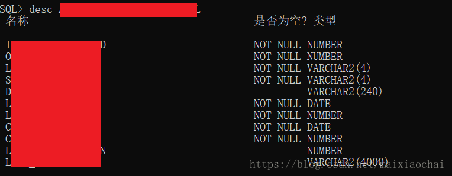
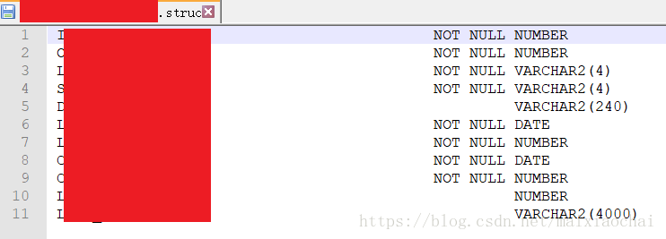
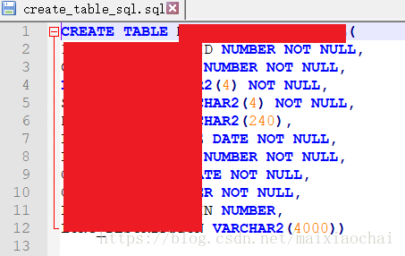

## desc_struc_to_sql.py

### 功能说明：
* 该工具旨在简化用oracle desc命令得出的表结构生成建表语句的过程。
* 人生短暂，将更多的时间投入到更有意义的事情中。

* 目前实现了基本功能    
    * 2018-10-23
        * 用由oracle ```desc your_table_name```命令获取的表结构生成建表语句。

### 1. 环境准备
* Python3.x.x
* Python库：os

### 2. 使用方法
* 生成单个建表语句
  * 用sqlplus连接到oracle，用```desc table_name```命令获取表结构，如下图所示，  
      
      
  * 然后将该结构保存到py脚本同级目录下的文件中，该文件名为要创建的数据表的名称，后缀为 *.struc*。如下图所示，  
      
     
  * 然后运行py脚本，```python desc_struc_to_sql.py```。之后会在同级目录下生成 *CREATE_TABLE_SQL.sql* 文件，里边是生成好的建表语句。如下图，  
      
    
  
* 生成多个建表语句
  * 若要生成多个建表语句，则只需要将不同的表结构保存在各自的 *table_name.struc* 文件中,  
    然后运行 ```python desc_struc_to_sql.py```，之后会在同级目录的*CREATE_TABLE_SQL.sql* 文件中生成所有的建表语句。


