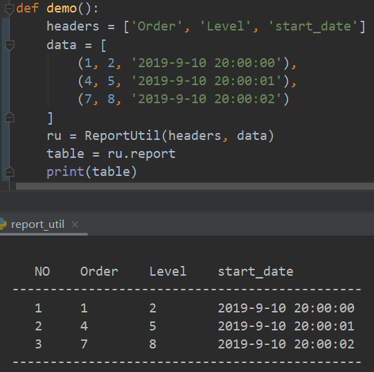

# 日志统计表格

##### 简介
+ 主要将日志中收集到的一些统计信息，以表格的形式输出，最终的内容都是字符串。

+  效果图
+  


+ **简单使用说明**：

  + 如图所示，`headers` 是表格的标题，标题数一定要和数据列数（data`中所有元素的最大长度）相同。

  + 标题最好用英文，中文会出现标题和列对应不上的问题。

  + **data** 和其元素可以是`list` 也可以是`tuple` 类型。

  + **最简使用代码**

    ```python
    ru = ReportUtil(headers, data)	# 实例化， header:标题,data:列表数据
    table = ru.report				# report 处理后的结果在实例ru的的report属性中
    print(table)
    ```

  + 更多细节的设置，在`__init__`中的**Config**部分，有注释帮助理解。

+ **Log**

  + [2019-9-11]
    + Created the `readme.md` file.

+ **the end**